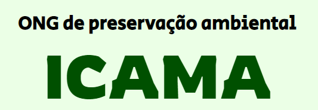

## <h1 align="center">- ICAMA ONG -</h1>

  

<a href="#tec">Tecnologias </a> &nbsp;&nbsp;&nbsp;|&nbsp;&nbsp;&nbsp; <a href="#pro"> Projeto </a> &nbsp;&nbsp;&nbsp;|&nbsp;&nbsp;&nbsp; <a href="#equi"> Equipe </a> 

 

    

 

<h2 id="tec"> 💻 Tecnologias </h2>

- HTML
- CSS
- Javascript
- Git e Github

 

<h2 id="pro"> 🌲 Projeto </h2>

Este projeto foi criado para o 16º MIT Fatec Itapetininga (Mostra de Iniciação Científico-Tecnológica da Faculdade de Tecnologia de Itapetininga).

 

Nosso objetivo é apresentar a ONG e arrecadar fundos com seus projetos.

- <b>Visite nosso site:</b> em andamento...

 

<h2 id="equi"> 👥 Equipe </h2>

- Alunos do 1º ciclo de ADS da Fatec (Ana Julia, Diogo Wernek, Julio Salem e Pedro)
- Alunos do 1º ciclo de GA da Fatec (Edson e Matheus)
- Aluna do 1º ciclo de Design da Uniso (Gabriela Almeida)

<h3> - Participações especiais </h3>

- Professora Carol (Organização)
- Ivan Baroni (Design)

 

